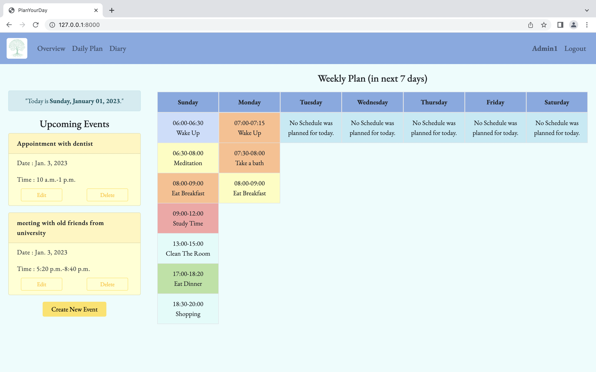
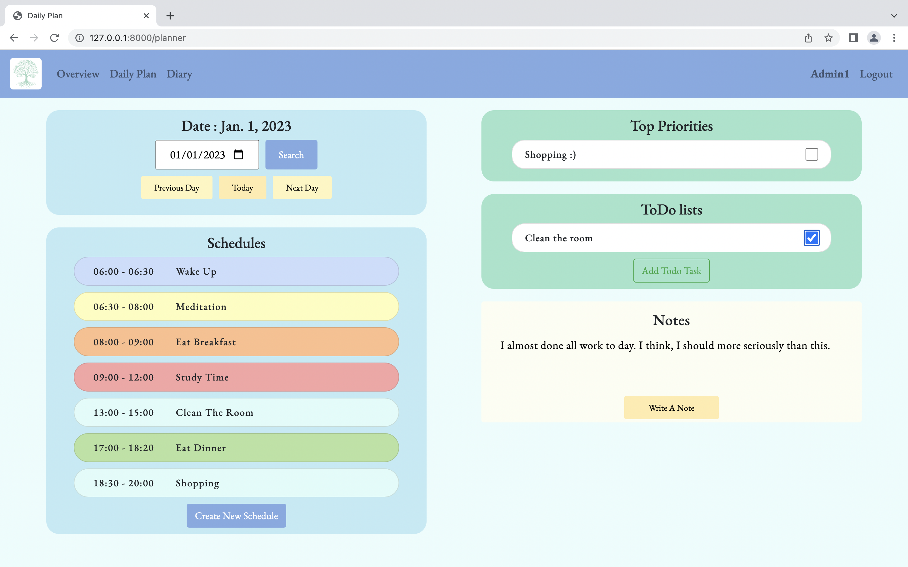
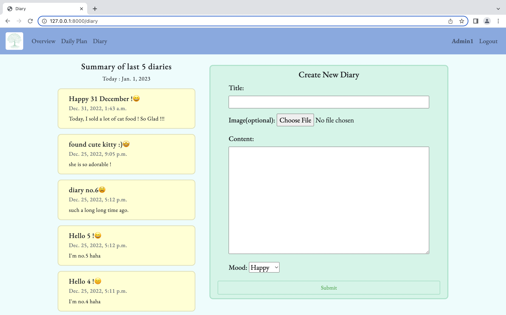
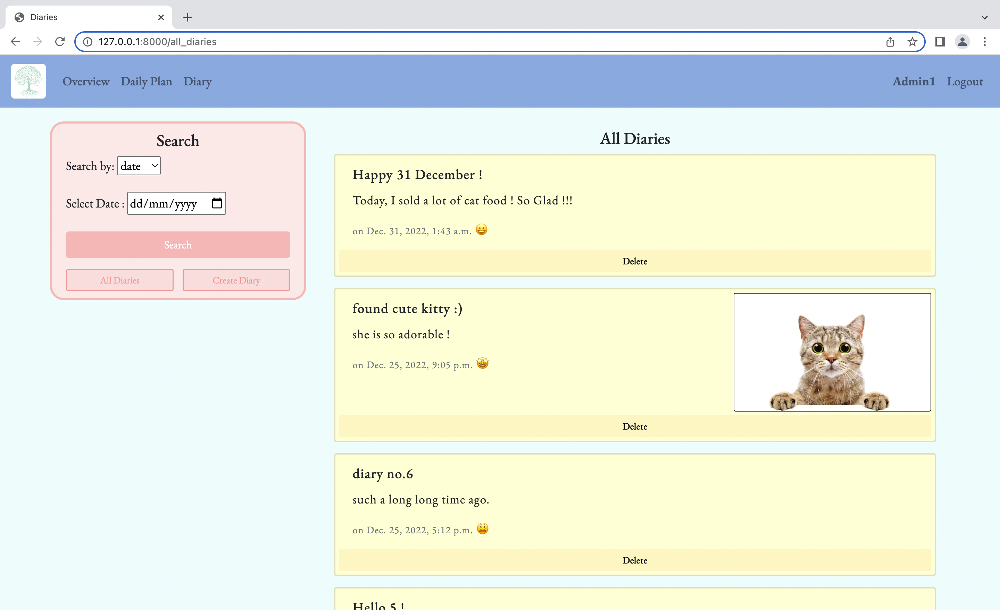

# CS50WEB Final Project : PlanYourDay

"PlanYouDay" is a web application that helps users plan their days and keep a personal diary. It includes three main pages: an overview page, a daily plan page, and a diary page.

## Features
1. The overview page displays the current date in Thailand timezone and a list of upcoming events. Users can create new events by clicking the "Create New Event" button, which brings up a form for entering the event details. Events that have already passed will not be displayed in the list of upcoming events. The overview page also includes a weekly plan that shows the schedules for the next seven days.

2. The daily plan page allows users to create schedules for specific dates. They can click the "Create New Schedule" button to bring up a form for entering the schedule details, including the name, start and end times, and background color. Schedules can be edited by clicking on them in the list of schedules. The page also includes a search function that allows users to navigate to different dates, as well as a to-do list where users can add tasks and mark them as complete. The page also includes a notes section where users can write notes about the selected date.

3.  The diary page contains two main sections: a summary of the last five diaries and a form for creating new diaries. Each diary entry includes the title, date, mood, image and content. Users can see more diaries by clicking the "See More Diaries..." button, which brings them to a separate page that displays all of the diaries. This page includes a search function that allows users to search by date or mood, as well as a "Create Diary" button that brings them back to the main diary page and "All Diaries" button that brings them back to see all diaries.




Overall, "PlanYouDay" is a comprehensive and feature-rich application that helps users plan their days, manage their tasks, and reflect on their experiences. It is built with Django on the back-end and JavaScript on the front-end, and is optimized for viewing on different devices with a responsive design

Youtube Video : https://www.youtube.com/watch?v=gQLACu0f5jA


## Build With 
- Django (back-end)
- JavaScript (front-end)
- HTML/CSS (front-end)

## Distinctiveness and Complexity

- My project is distinctive in that it offers a unique approach to daily planning and diary-keeping. It includes three main pages: an overview page that displays upcoming events and a weekly plan, a daily plan page where users can create schedules and manage a to-do list, and a diary page where users can write personal entries and reflect on their mood and experiences. 
- My project is complex in that it involves a number of interconnected components, including a database, a user interface, and various algorithms and processes for managing data. The project is built with Django as the back-end framework, and includes a number of models and views to handle user input and display data. Additionally, the project utilizes JavaScript for interactive elements on the front-end.
- My project is also designed to be responsive, meaning it is optimized for viewing on different devices with varying screen sizes. This is achieved through the use of CSS media queries and a responsive layout, allowing the user interface to adapt to different screen sizes and orientations.

## Files and Directories.

- plan : This directory contains the code for the "PlanYourDay" app.
    * statics : contains static files that are used in the "PlanYouDay" app.
        - diaries.js : the script for the all_diaries.html template 
        - overview.js : the script for the index.html template 
        - schedule.js : the script for the planner.html template 
        - styles.css : the style for all templates
    * templates/plan : contains HTML files for "PlanYourDay" app.
        - all_diaries.html : a template that displays a list of all diaries. It includes a search function that allows users to filter the list by date or mood.
        - diary.html : a template that displays a summary of the user's last five diaries and includes a form for creating new diary entries.
        - index.html : a template that displays the current date in Thailand time, a list of upcoming events and weekly schedules.
        - layout.html : a template contain overall layout and design of the website.
        - login.html : a login template.
        - planner.html : a template that display scedule, todo-task and note.
        - register.html : a register template. 
    * admin.py : contains files related to the Django administration interface for the "PlanYourDay" app.
    * models.py : contains the models for the "PlanYourDay" app, which define the data structures and relationships used in the app.
    * urls.py : contain all url in "PlanYourDay" app.
    * views.py : contains the views for the "PlanYourDay" app.
- Project5 : This is the root directory of the Django project.
    * settings.py : contains the settings for the Django project.
    * urls.py : contains the URL patterns for the Django project.
- uploaded_files/images :This directory contains images that are used in the project.

### Models
1. User: This model extends the built-in Django AbstractUser model and adds no additional fields. It is used to store user accounts in the application.
2.  Schedule: This model represents a schedule that a user has created. It includes fields for the name, date, start and end times, and background color of the schedule. It also has a foreign key to the User model, which indicates the user who created the schedule.
3. todo_list: This model represents a task that a user has added to their to-do list. It includes fields for the name, date, and completion status of the task, as well as a field for indicating whether the task is a top priority. It also has a foreign key to the User model, which indicates the user who created the task. The is_toppriorities field is a boolean field that is set to True if the task is marked as a top priority, and False otherwise.
4. Note: This model represents a note that a user has created in the planner. It includes fields for the content and date of the note, as well as a foreign key to the User model.
5. Diary : This model represents a user's personal diary entry. It includes fields for the title, timestamp, content, image, and mood of the diary entry, as well as a foreign key to the User model to indicate the user who created the entry.The title field is a text field that allows the user to give their diary entry a title. The timestamp field is a date and time field that records the date and time that the diary entry was created. The content field is a text field that allows the user to write the content of their diary entry. The image field is an image field that allows the user to include an image in their diary entry, and is stored in the uploaded_files/images directory. The mood field is a text field that allows the user to describe their mood when they wrote the diary entry.
## How to run your application.
- In your terminal, cd into the Project5 directory.
- Install the required libraries by running the following command
```pip install -r requirements.txt```
- Run the following commands in your terminal to migrate the database and create a superuser(optional):
```
python manage.py makemigrations
python manage.py migrate
python manage.py createsuperuser
```
- Run the development server by running the following command:
```
python manage.py runserver
```
- Go to http://127.0.0.1:8000/ in your web browser to access the application.